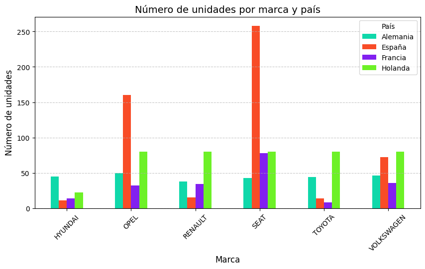
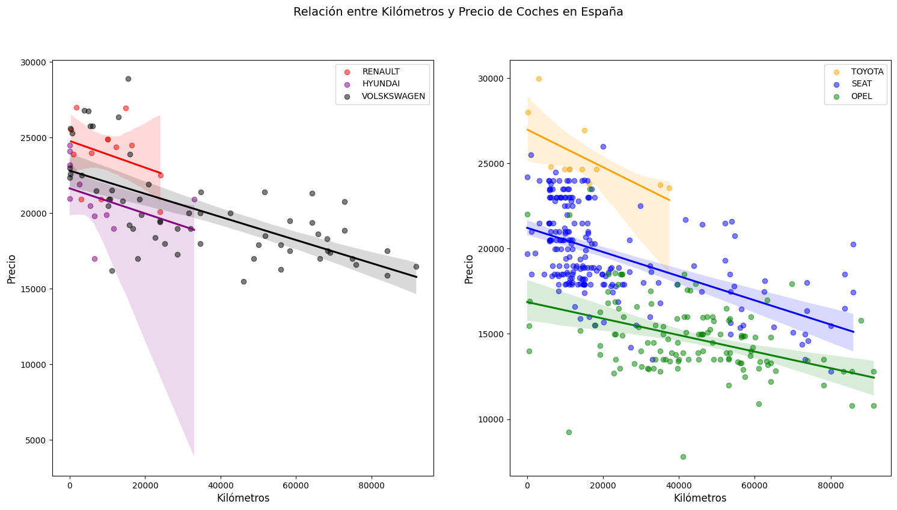
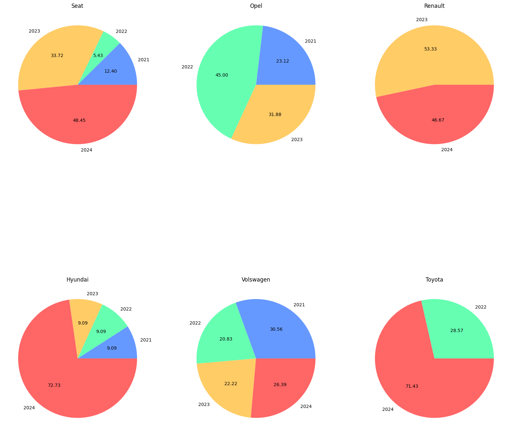

# Car Market Web Scraping Analysis 🚗


Web scraping and exploratory analysis of used car listings from multiple automotive marketplaces across four European countries: **Spain**, **France**, **Netherlands**, and **Germany**.

---

## Overview

This project collects, cleans, and analyzes used car listings from multiple automotive marketplaces across several European countries. The goal is to build a comparable dataset of vehicles with similar characteristics and perform exploratory analyses on pricing, mileage, and registration year patterns by country.

The project is divided into three main stages:

1. **Web scraping** of used car listings from multiple online marketplaces
2. **Data cleaning and transformation** into country-level datasets
3. **Exploratory analysis and visualization** using Jupyter notebooks

---

## Objectives

- Scrape car listing data from multiple sources in different countries
- Standardize and clean heterogeneous datasets
- Build processed datasets grouped by country
- Compare used car market patterns across countries
- Explore relationships between registration year, mileage, and price across markets

---

## Data Sources

The data was collected from the following websites:

| Country | Sources |
|---|---|
| 🇪🇸 Spain | Autocasion, Clicars, Flexicar, OcasionPlus, CochesMobile |
| 🇫🇷 France | AutoScout24 France |
| 🇳🇱 Netherlands | AutoScout24 Netherlands |
| 🇩🇪 Germany | Mobile.de |

> Different scraping scripts were required for each website due to differences in HTML structure and extraction logic.

---

## Project Workflow

```text
Web Scraping Scripts
        ↓
Raw CSV files (per source)
        ↓
Data Cleaning Notebook
        ↓
Processed CSV files (per country)
        ↓
Analysis Notebooks and Visualizations
```

---

## Repository Structure

```text
car-market-web-scraping-analysis/
├── data/
│   ├── raw/                        # Raw scraped CSV files
│   └── processed/                  # Cleaned country-level CSV files
├── notebooks/
│   ├── data_cleaning.ipynb
│   ├── year_vs_country.ipynb
│   ├── price_vs_mileage.ipynb
│   └── cars_by_country.ipynb
├── src/
│   ├── main.py
│   └── scrapers/
│       ├── autocasion.py
│       ├── autoscout24_france.py
│       ├── autoscout24_netherlands.py
│       ├── clicars.py
│       ├── cochesmobile.py
│       ├── flexicar.py
│       └── ocasion_plus.py
├── assets/
│   └── images/
│       ├── country_model.png
│       ├── km_price_spain.png
│       └── years.png
├── README.md
├── requirements.txt
├── .gitignore
└── LICENSE
```

---

## Processed Datasets

After cleaning and standardizing the raw data, the project generates the following country-level datasets stored in `data/processed/`:

- `cars_spain.csv`
- `cars_france.csv`
- `cars_netherlands.csv`
- `cars_germany.csv`

---

## Selected Brands for Comparison

To keep the analysis consistent across countries, the project focuses on six comparable brands:

**Hyundai · Opel · Renault · SEAT · Toyota · Volkswagen**

---

## Analysis Notebooks

### 1. `data_cleaning.ipynb`
Reads the raw CSV files from `data/raw/` and generates cleaned, standardized datasets per country in `data/processed/`.

### 2. `year_vs_country.ipynb`
Analyzes how the registration year of selected brands is distributed across countries, identifying whether listings are concentrated in newer or older vehicles depending on the market.

### 3. `price_vs_mileage.ipynb`
Studies the relationship between vehicle mileage and listing price, focusing on selected brands in each country.

### 4. `cars_by_country.ipynb`
Compares how frequently selected brands appear in each country's listings, allowing a cross-market comparison of brand presence.

---

## Visualizations & Analysis

The analysis covers **4 countries**, **6 brands**, and **3 analytical dimensions**. For each market, equivalent visualizations were generated — the charts below are representative examples from the Spanish market. All charts are available by running the analysis notebooks.

The three dimensions analyzed were:

| Dimension | What it shows |
|---|---|
| Registration year | How recent the available stock is per brand and country |
| Mileage vs Price | How km driven affects listing price per brand |
| Brand volume | How many listings each brand has in each national market |

---

### Brand Listing Volume by Country



A clear pattern emerges: **brands tend to be more heavily listed in their country of origin or strongest regional market**. SEAT, for example, appears far more frequently in Spanish listings than in any other country — a direct reflection of its local market dominance.

---

### Mileage vs Price (Spain)



Across all brands and markets, **higher mileage consistently correlates with lower listing prices**. However, the rate of depreciation varies by brand — some manufacturers hold their value better at high mileage than others, which can be a useful signal when comparing listings across countries.

---

### Registration Year Distribution by Brand (Spain)



Registration year distribution **varies significantly depending on the brand**, with some showing a strong concentration in very recent years (2023–2024) while others have a more spread-out profile. This reflects differences in fleet renewal rates and marketplace supply across brands and markets.

---

> These are three examples of the visualizations generated. Equivalent charts exist for all four countries and six brands. By combining these three dimensions it is possible to draw cross-market conclusions — such as whether domestic brands are priced lower in their home market, or which brands depreciate fastest with mileage.

---

## Key Findings

- **Mileage and price are inversely related**: higher mileage consistently corresponds to lower listing prices across all brands and markets.
- **Brand presence varies by country**: some brands appear far more frequently in specific markets (e.g. SEAT in Spain).
- **Recent registration years dominate**: most listings, especially in Spain, are concentrated in 2023–2024 vehicles.
- **Cross-country patterns differ**: the same brand can show very different availability depending on the national marketplace and source.

> **Note:** this project analyzes listing data, not completed sales. Conclusions reflect marketplace availability and listed prices, not final purchase behavior.

---

## Technologies Used

- Python
- Selenium & WebDriver Manager
- Pandas
- NumPy
- Matplotlib
- Seaborn
- Jupyter Notebook

---

## Installation

Clone the repository and install dependencies:

```bash
git clone https://github.com/your-username/car-market-web-scraping-analysis.git
cd car-market-web-scraping-analysis
pip install -r requirements.txt
```

---

## How to Run

### 1. Run the scraping scripts

The scraping logic is in `src/scrapers/`. Run the main entry point:

```bash
python src/main.py
```

> Some scraping functions may need to be enabled manually inside `main.py` depending on the target source.

### 2. Clean the raw datasets

Run the cleaning notebook to generate the processed country-level datasets:

```bash
notebooks/data_cleaning.ipynb
```

### 3. Run the analysis notebooks

Once the processed datasets are ready, open and run any of the analysis notebooks:

```bash
notebooks/year_vs_country.ipynb
notebooks/price_vs_mileage.ipynb
notebooks/cars_by_country.ipynb
```

---

## Limitations

- Analysis depends on listings available at the time of scraping
- Different websites provide different data volumes and structures
- Some countries required combining multiple sources to obtain a comparable sample
- The project focuses on listing behavior, not confirmed transactions

---

## Future Improvements

- Fully unify scraper output schema across all sources
- Automate the scraping → cleaning → analysis pipeline end-to-end
- Improve duplicate detection across sources
- Expand the study to more countries or marketplaces

---

## Authors

- Diego J. García Callejas

---

## License

This project is licensed under the [MIT License](LICENSE).

> The dataset was collected for educational and portfolio purposes. Before reusing or extending the scraping scripts, please review the terms of service of each website.
